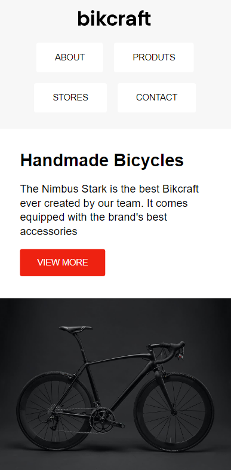

# Bikcraft

The "Bikcraft" project showcases a modern, responsive webpage for a handcrafted bicycle brand. The site emphasizes clean design, accessibility, and optimal user experience. The layout is built using CSS Grid and Flexbox, ensuring a well-structured and adaptable interface across various devices.

## Table of Contents

- [Preview](#preview)
- [Properties Demonstrated](#properties-demonstrated)
- [Keys Sections](#key-sections)
- [Technologies Used](#technologies-used)
- [Usage](#usage)
- [Project Structure](#project-structure)
- [Contributing](#contributing)

## Preview



## Properties Demonstrated

- **Responsive Design:**

  - Media queries are utilized to adjust the layout and styling based on the device's screen size, ensuring a seamless experience across desktops, tablets, and mobile devices.

- **CSS Grid Layout:**

  - The main content sections, including the introduction and benefits, are arranged using CSS Grid, allowing for precise control over the positioning and alignment of elements.

- **Flexbox for Navigation and Footer:**

  - The navigation menu and footer leverage Flexbox for easy alignment and distribution of items, ensuring a clean and consistent look.

- **Custom Hover Effects:**

  - Interactive hover effects on navigation links and benefit items, enhancing user engagement.

- **Accessible Markup:**
  - Semantic HTML elements and ARIA labels are used throughout the code to improve accessibility, making the site usable by a broader audience, including those relying on assistive technologies.

## Key Sections

- **Introduction:**
  Features a visually appealing introduction to the "Bikcraft" brand, with a call-to-action button and an image of the featured bicycle.
- **Benefits:**
  Highlights the unique selling points of the Bikcraft bicycles, with icons and descriptions arranged in a grid layout.
- **Footer:**
  A simple and elegant footer section that contains copyright information.

## Technologies Used

- HTML5
- CSS3

## Usage

1. **Clone the repository:**
   ```bash
   git clone https://github.com/your-username/Bikcraft.git
   ```
2. **Navigate to the project directory:**
   ```bash
   cd Bikcraft
   ```
3. **Open the HTML file in your browser:**
   ```bash
     open index.html
   ```
   or simply double-click on the `index.html` file.

## Project Structure

Bikcraft/ <br>
│<br>
├── css/<br>
│ └── style.css<br>
├── imgs/<br>
│ └── bicycle.png - bicycle image used on the website<br>
│ └── bikcraft.png - logo bikcraft<br>
│ └── eletric.svg - eletric svg used on the website<br>
│ └── speed.svg - speed svg used on the website<br>
│ └── tracker.svg - tracker svg used on the website<br>
│ └── wave.svg - wave svg used on the website<br>
│ └── website.png - image for presentation<br>
├── index.html - main HTML file with grid examples<br>
└── README.md - project README<br>

## Contributing

We welcome contributions! Please follow these steps to contribute:

1. **Fork the repository:**
2. **Create a new branch:**
   ```bash
     git checkout -b feature/your-feature-name
   ```
3. **Commit your changes:**
   ```bash
     git commit -m 'Add some feature'
   ```
4. **Push to the branch:**
   ```bash
     git push origin feature/your-feature-name
   ```
5. **Create a Pull Request:**
